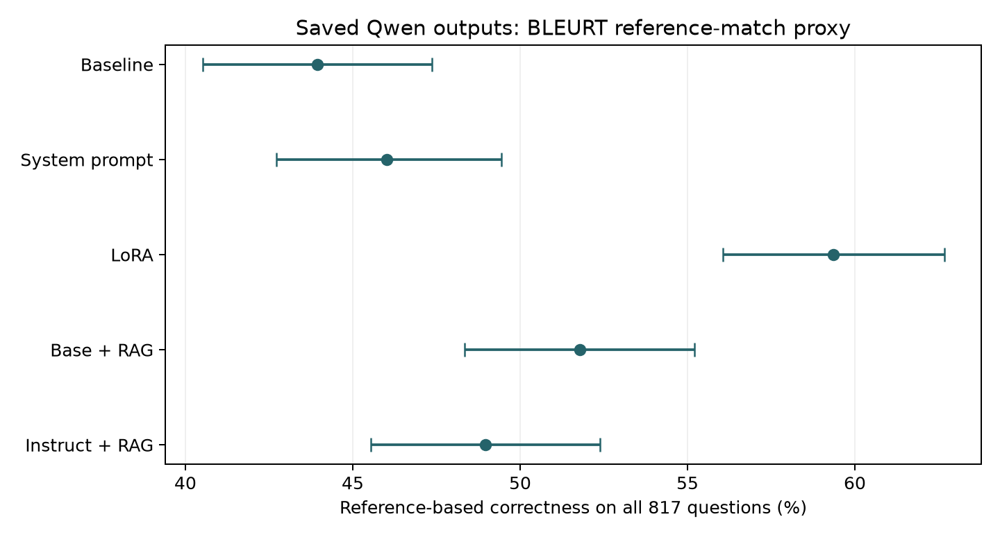

# Evaluating Saved Qwen Answers on TruthfulQA

A three-person coursework project comparing five Qwen 2.5 answer files: baseline, system prompting, LoRA fine-tuning, base-model RAG, and instruction-tuned RAG. The current repository evaluates the saved outputs on the **same 817 questions**; it does not retrain models or regenerate answers.

## Results on all questions

**Primary metric: reference-based correctness across all 817 questions.** Every question contributes, including blank answers. Confidence intervals are percentile intervals from 10,000 question-level bootstrap resamples (seed 20261008).

| Saved answer set | Correctness, all questions | 95% bootstrap CI (%) | Cosine > 0.60 subset | Correctness in that subset |
| --- | ---: | ---: | ---: | ---: |
| Baseline | 43.94% | [40.51, 47.37] | 318 / 817 | 42.45% |
| System prompt | 46.02% | [42.72, 49.45] | 618 / 817 | 44.98% |
| LoRA | 59.36% | [56.06, 62.67] | 516 / 817 | 60.27% |
| Base + RAG | 51.77% | [48.35, 55.20] | 292 / 817 | 46.92% |
| Instruct + RAG | 48.96% | [45.53, 52.39] | 685 / 817 | 49.34% |

The final two columns are diagnostic. Each model selects a different similarity-filtered subset, so filtered percentages cannot provide a fair ranking of the models. Cosine similarity is not a calibrated probability of correctness.



The LoRA answer file has the highest unfiltered reference-match rate. Its training data and the RAG corpora are unknown; these results do **not establish a leakage-free improvement attributable to adaptation**. See [model provenance](MODEL_PROVENANCE.md).

[Paired comparisons](results/paired_comparisons.csv) use matched questions, bootstrap intervals for differences, exact McNemar tests on discordant correctness labels, and Holm-adjusted p-values across all ten model pairs. Question-level resampling describes uncertainty across benchmark questions; it does not capture generation variability, training uncertainty, or reference-labelling error.

The full evaluation ran on 8 October 2026. [Run metadata](results/run_metadata.json) records input hashes, checkpoints, package versions, seed, and runtime; individual scored answers are included for audit. Historical coursework summaries are retained as `results/original_*.csv`, but the table above uses recomputed scores.

## Scoring method and limits

For each answer, BLEURT scores all supplied correct and incorrect references. The reference with the largest score determines the binary label: correct if it is from the correct-answer set. References are ordered with correct ones first, so exact ties favour the correct set, preserving the original project rule. Blank answers and the repeated no-comment string handled in the source are scored incorrect.

This proxy uses available reference labels and rewards semantic agreement rather than exact wording. BLEURT was trained to predict text-generation quality, however, and a nearest reference can miss contradictions or factual errors. These scores are **not human truth judgements**, do not measure informativeness, and are separate from TruthfulQA's multiple-choice task. The upstream benchmark also supports reference-based metrics; this project's cosine filter is an additional diagnostic, not a standard benchmark score. [TruthfulQA source and evaluation](https://github.com/sylinrl/TruthfulQA).

The scorer is explicitly `bleurt-base-128`, matching the default in the original `evaluate.load("bleurt")` call. It truncates long reference/answer pairs to a combined 128 WordPiece tokens. Selected-reference cosine similarity uses `sentence-transformers/all-MiniLM-L6-v2` at a pinned revision. Auxiliary BLEU/ROUGE summaries from the old workflow are not recomputed: the revised analysis focuses on the correctness proxy, similarity coverage, and paired comparisons.

## Model and contribution disclosures

The exact Qwen parameter count and checkpoint revision, LoRA training examples/splits, retrieval corpus, generation settings, and benchmark-overlap checks are **unknown**. The supplied CSV filenames identify the variants, but they do not establish those details. Similarity columns embedded in the two RAG output files are ignored and all references are read from the supplied benchmark file.

Original project contributors: **Laura Maria Fetz, Martin Turna, and Bart Amin**. Individual responsibilities were not documented in the available project materials, so training, retrieval construction, and other original implementation tasks are not attributed to a particular person. [Full provenance disclosures](MODEL_PROVENANCE.md).

## Run

Use **Python 3.12**; the verified run used Python 3.12.14 with CPU scoring.

```bash
python3.12 -m venv .venv
source .venv/bin/activate
python -m pip install -r requirements.txt
python analysis.py
```

The first full run downloads the BLEURT checkpoint and sentence-embedding model to the ignored `.cache/` directory. It then scores all five files and writes CSVs, a figure, and metadata to `results/`.

To check the inputs or recompute the statistical tables from the included scored answers:

```bash
python analysis.py --validate-only
python analysis.py --summarize-only
python test_statistics.py
```

`--summarize-only` verifies the question keys and saved answers against current inputs. The small statistical checks cover question alignment under row reordering, identical model pairs, the exact discordant-pair p-value, and an empty filtered subset.

## Files and data attribution

```text
LLM-Evaluation-Truthfulness/
├── analysis.py
├── test_statistics.py
├── requirements.txt
├── MODEL_PROVENANCE.md
├── THIRD_PARTY_NOTICES.md
├── LICENSES/TruthfulQA-Apache-2.0.txt
├── data/                        # Benchmark and five saved answer sets
├── results/                     # Scored answers, summaries, paired tests, figure
├── .gitignore
└── README.md
```

TruthfulQA is credited to Stephanie Lin, Jacob Hilton, and Owain Evans. Its Apache 2.0 licence and source attribution are preserved in [third-party notices](THIRD_PARTY_NOTICES.md). The supplied CSV is the course version of the benchmark, not a substitution with a newer upstream file.

References: [TruthfulQA (Lin et al., 2021)](https://arxiv.org/abs/2109.07958), [BLEURT (Sellam et al., 2020)](https://arxiv.org/abs/2004.04696).
